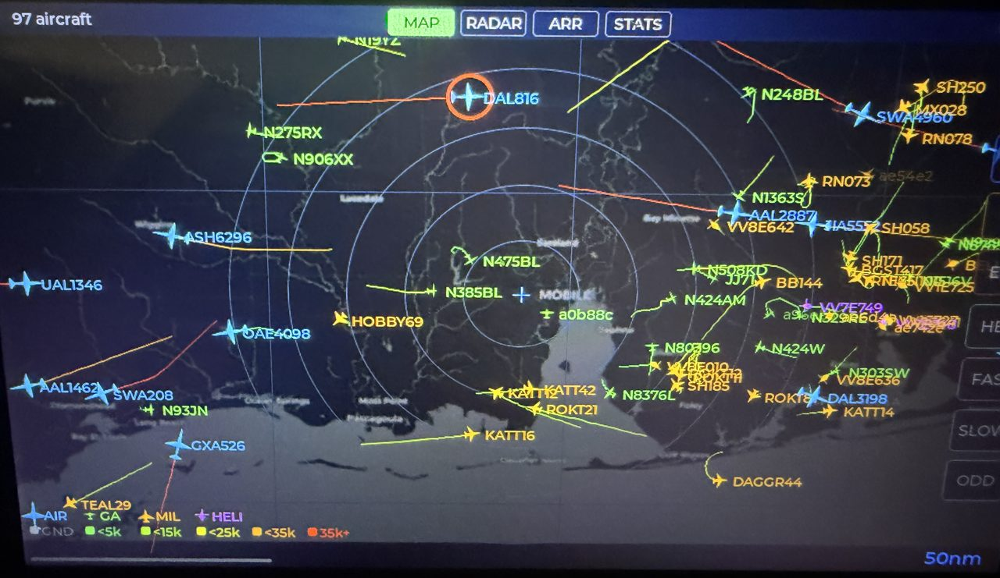
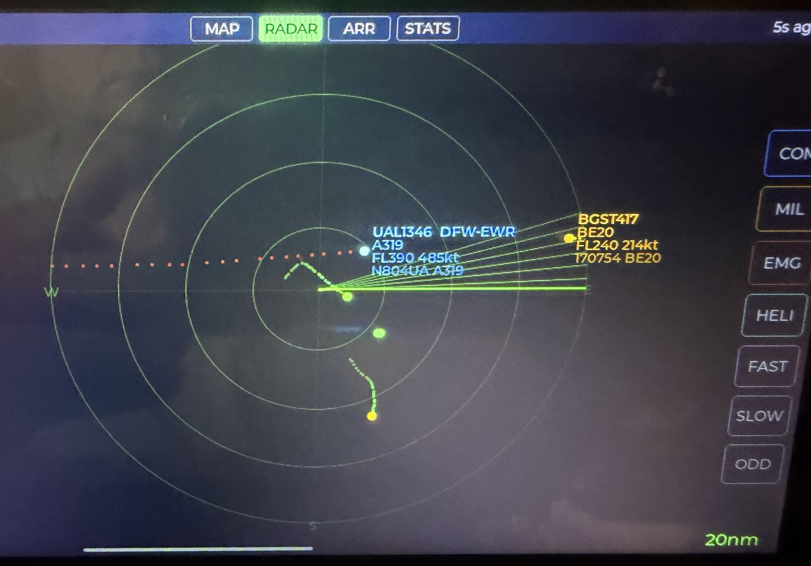
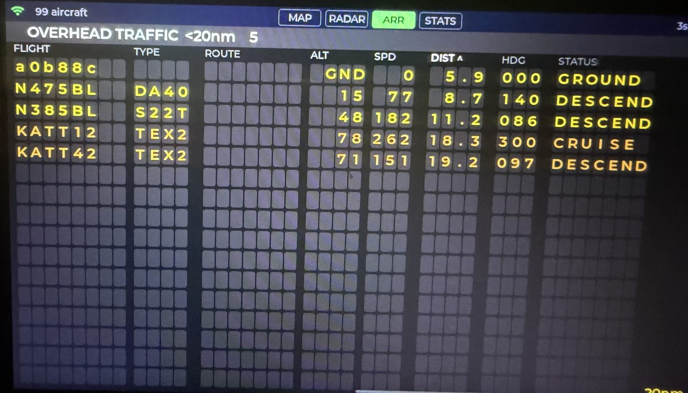
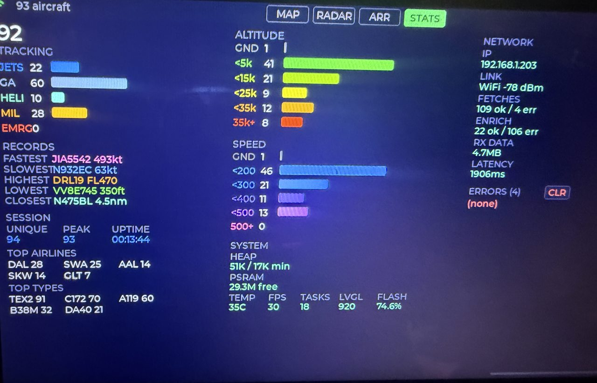
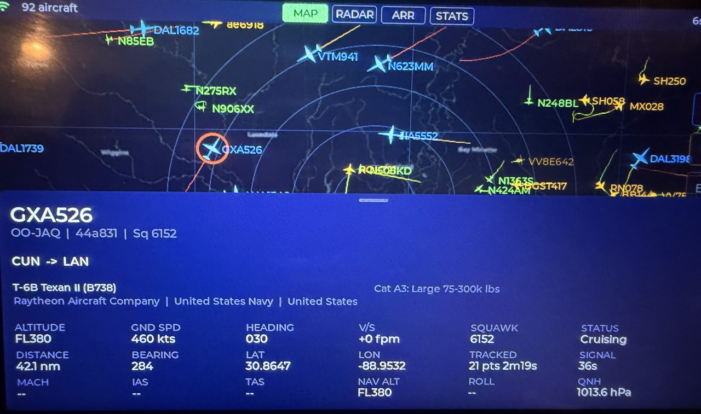
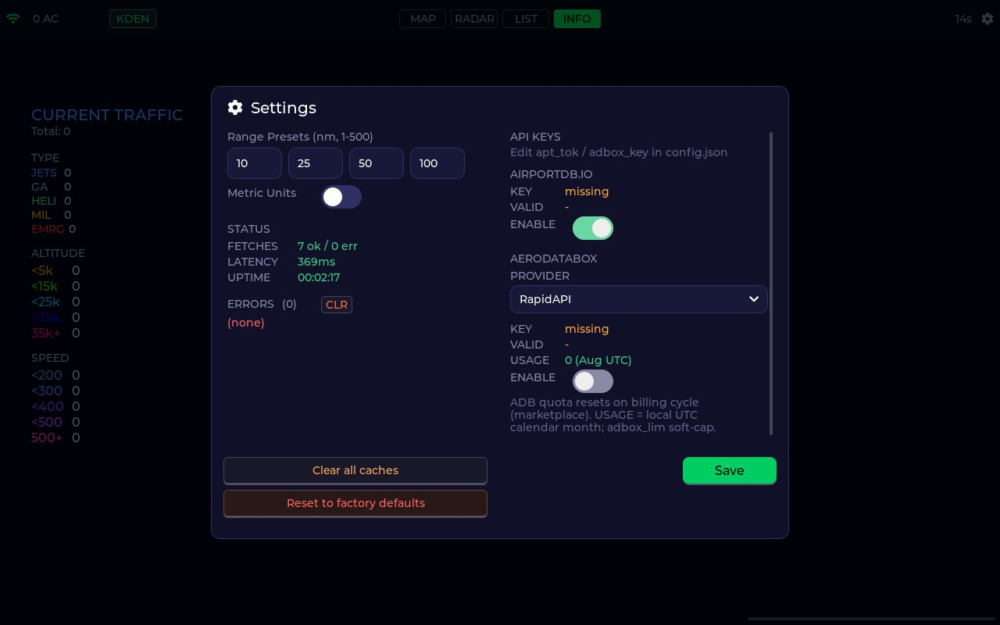

# FlightLevel314

Live ADS-B traffic on a Raspberry Pi touchscreen — map, radar, traffic list,
and session stats — built for a Waveshare 10.1″ DSI panel (1280×800).

Traffic comes from [adsb.lol](https://adsb.lol) by default; Settings →
**TRAFFIC SOURCE** can switch to [adsb.fi](https://adsb.fi) (`traffic_prov` in
`config.json`: `0` = lol, `1` = fi). Saved locations, basemap /
weather overlays, aircraft detail cards (adsbdb + Planespotters photos), and
optional AirportDB / AeroDataBox enrichment round it out.

**Name:** Flight Level 314… because π.

<p align="center">
  
</p>

## Screenshots

| Map | Radar |
|-----|-------|
|  |  |

| Traffic list | Session info |
|--------------|--------------|
|  |  |

| Aircraft detail | Settings |
|-----------------|----------|
|  |  |

> Panel photos above were taken on the Waveshare display with live traffic.
> Nav labels in some shots still say ARR / STATS; the current build uses
> **LIST** / **INFO**. Settings reflects the current UI.

## Hardware

| Item | Notes |
|------|--------|
| **Display** | [Waveshare 10.1″ DSI capacitive touch](https://www.waveshare.com/10.1-dsi-lcd.htm) (1280×800) |
| **Board** | Raspberry Pi 5 / 4B (Waveshare also lists 3B+ / 3A+ / CM variants — verify before buying a plain 3B) |
| **OS** | Raspberry Pi OS Lite (no desktop). The app owns DRM/KMS as a systemd kiosk service. |

A desktop Linux or macOS machine can run the same binary with the **SDL**
backend for development (windowed 1280×800).

## Features

- **MAP** — geographic basemap, range rings, callsigns / trails, category filters
- **RADAR** — classic sweep display with the same filters and tags
- **LIST** — sortable traffic board within the selected range
- **INFO** — session counts, records, airlines / types seen
- Saved locations (ICAO or lat/lon), range presets, VIEW menu (trails / tags)
- Detail card: identity, telemetry, optional photo + O/D enrichment
- Optional **AirportDB.io** runways and **AeroDataBox** origin/destination

## Build (SDL simulator)

```bash
sudo apt install build-essential cmake libcurl4-openssl-dev libsdl2-dev
cmake -S . -B build -DPI_DISPLAY_BACKEND=SDL
cmake --build build -j$(nproc)
./build/pi/flightlevel314
```

Config and caches live under `~/.config/flightlevel314/`.

## Build (Pi DRM kiosk)

```bash
sudo apt install build-essential cmake libcurl4-openssl-dev \
    libdrm-dev libinput-dev pkg-config
cmake -S . -B build -DPI_DISPLAY_BACKEND=DRM
cmake --build build -j4
./build/pi/flightlevel314
```

Add your user to the `video`, `render`, and `input` groups if DRM or touch
fail to open.

DSI panel brightness (Settings → DEVICE) writes
`/sys/class/backlight/*/brightness`. If the slider does nothing, add a udev
rule so the service user can write it:

```bash
echo 'SUBSYSTEM=="backlight", RUN+="/bin/chmod 666 /sys/class/backlight/%k/brightness /sys/class/backlight/%k/bl_power"' \
  | sudo tee /etc/udev/rules.d/99-backlight.rules
sudo udevadm control --reload-rules
sudo udevadm trigger -s backlight
```

### Install as a service

```bash
sudo useradd -r -G video,input,render flightlevel314
sudo mkdir -p /opt/flightlevel314
sudo cp build/pi/flightlevel314 /opt/flightlevel314/

sudo mkdir -p /opt/flightlevel314/.config/flightlevel314
sudo cp ~/.config/flightlevel314/*.json \
    /opt/flightlevel314/.config/flightlevel314/ 2>/dev/null || true
sudo chown -R flightlevel314:flightlevel314 /opt/flightlevel314/.config

sudo cp pi/flightlevel314.service /etc/systemd/system/
sudo systemctl daemon-reload
sudo systemctl enable --now flightlevel314
```

Logs: `journalctl -u flightlevel314 -f`.

## Configuration

| Path | Role |
|------|------|
| `~/.config/flightlevel314/config.json` | Preferences, API keys, display options |
| `~/.config/flightlevel314/locations.json` | Saved map centers |

API keys are **not** typed on the touchscreen. Edit `config.json` by hand:

```json
{
  "apt_tok": "your-airportdb-token",
  "adbox_key": "your-aerodatabox-key",
  "traffic_prov": 0
}
```

Then open **Settings** (gear) → enable AirportDB / AeroDataBox under API KEYS
and pick the AeroDataBox gateway if needed. Use **TRAFFIC SOURCE** to choose
adsb.lol or adsb.fi.

### App updates (Pi)

Tagged GitHub Releases publish `flightlevel314-linux-aarch64` (DRM/Pi) and
`flightlevel314-linux-x86_64` (SDL). Settings → **DEVICE** can check for a
newer release, download the matching binary over the running path, and exit so
`systemd` restarts the kiosk. The status bar shows `Upd vX.Y.Z` when an update
is available. Dev builds report `v0.0.0-dev` and always see a newer tag as an
update.

## Layout

| Path | Role |
|------|------|
| `pi/` | Linux entrypoint, display/input, basemap/weather |
| `src/ui`, `src/data` | UI + data layer |
| `tools/` | Airport DB / static map generators |
| `docs/project-knowledge.md` | History and backlog |

## Credits

Original ADS-B display work by **Neil** (see [`LICENSE`](LICENSE)).

This project is the Raspberry Pi line of that work, continued from
[dpoler/adsb](https://github.com/dpoler/adsb) (which also hosted an ESP32 /
JC1060 port that is paused). FlightLevel314 is Pi / Linux only.

## License

MIT — see [`LICENSE`](LICENSE).
